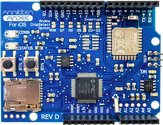

# Annikken Support Page

## Click on the topics of the product you require help with below

### Andee U

* [Installing the Arduino IDE](https://annikken.github.io/andeedocs/AndeeSetup/#installing-arduino-ide)

* [Installing the Andee Library on the Arduino IDE](https://annikken.github.io/andeedocs/AndeeSetup/#installing-andee-library)

* [Re-installing the firmware on the Andee U board](https://annikken.github.io/andeedocs/AndeeSetup/#andee-uandroid)

### Andee Android

* [Installing the Arduino IDE](https://annikken.github.io/andeedocs/AndeeSetup/#installing-arduino-ide)

* [Installing the Andee Library on the Arduino IDE](https://annikken.github.io/andeedocs/AndeeSetup/#installing-andee-library)

* [Re-installing the firmware on the Andee Android board](https://annikken.github.io/andeedocs/AndeeSetup/#andee-uandroid)

### Andee iOS

* [Installing the Arduino IDE](https://annikken.github.io/andeedocs/AndeeSetup/#installing-arduino-ide)

* [Installing the Andee Library on the Arduino IDE](https://annikken.github.io/andeedocs/AndeeSetup/#installing-andee-library)

* [Re-installing the firmware on the Andee iOS board](https://annikken.github.io/andeedocs/AndeeSetup/#andee-ios)

### Andee API Reference

[Go to Annikken Andee Documentation](https://annikken.github.io/andeedocs)

### AndeeBot
